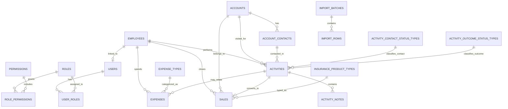

# ERD Draft

## 1. Amaç

Bu belge, MVP için önerilen veri modelini açık ve sade şekilde ortaya koymak amacıyla hazırlanmıştır. Amaç, aktivite, satış ve masraf akışlarını ortak boyutlarla ilişkilendirerek hem operasyonel kayıt tutmayı hem de dashboard/KPI üretimini destekleyen bir veritabanı omurgası oluşturmaktır.

Bu ERD taslağı nihai şema değildir. Açık sorular netleştikçe güncellenmelidir. Ancak başlangıç için yeterince sade ve uygulanabilir bir çerçeve sunar.

## 2. Modelleme İlkeleri

- Aktivite, satış ve masraf ayrı transaction alanlarıdır.
- Satış mümkün olduğunca bir aktiviteye bağlanmalıdır.
- Müşteri ve firma ayrımı MVP'de aşırı karmaşıklaştırılmamalıdır.
- Dashboard verisi ham transaction kayıtlarından türetilmelidir.
- Referans tabloları ile transaction tabloları ayrılmalıdır.
- Audit alanları tüm temel tablolarda düşünülmelidir.

## 3. MVP İçin Önerilen Çekirdek Yaklaşım

MVP aşamasında müşteri ve firma yapısı için ayrı ayrı çok parçalı model yerine `Account` merkezli yapı önerilir.

`Account` şu iki tipi taşıyabilir:

- Individual
- Corporate

Bu sayede bireysel müşteri ve kurumsal firma aynı üst yapıdan yönetilir. İleride ihtiyaç olursa temas kişileri için ayrı `AccountContact` tablosu eklenebilir.

## 4. Ana Tablolar

### 4.1 Security / Identity

- `users`
- `roles`
- `permissions`
- `user_roles`
- `role_permissions`

### 4.2 Organization

- `employees`

### 4.3 Master / Reference

- `accounts`
- `account_contacts`
- `lead_status_types`
- `lead_source_types`
- `activity_contact_status_types`
- `activity_outcome_status_types`
- `insurance_product_types`
- `expense_types`

### 4.4 Operations

- `leads`
- `lead_assignments`
- `activities`
- `activity_notes`
- `sales`
- `expenses`

### 4.5 Data Governance

- `import_batches`
- `import_rows`
- `audit_logs`

## 5. Tablo Detayları

## 5.0 `lead_status_types`

- `id`
- `code`
- `name`

Örnek:

- `NEW`
- `READY_FOR_ASSIGNMENT`
- `ASSIGNED`
- `VISITED`
- `CONVERTED_TO_ACTIVITY`

## 5.0.1 `lead_source_types`

- `id`
- `code`
- `name`

Örnek:

- `CALL_CENTER`
- `MANUAL`
- `REFERRAL`

## 5.0.2 `leads`

- `id` UUID, PK
- `code`
- `potential_name`
- `phone` nullable
- `email` nullable
- `city` nullable
- `district` nullable
- `note` nullable
- `lead_status_type_id` FK
- `lead_source_type_id` FK
- `owner_user_id` FK nullable
- `linked_account_id` FK nullable
- `converted_activity_id` FK nullable
- `created_at`
- `created_by`
- `updated_at`
- `updated_by`

## 5.0.3 `lead_assignments`

- `id` UUID, PK
- `lead_id` FK
- `assigned_employee_id` FK
- `assigned_by_user_id` FK
- `assigned_at`
- `priority` nullable
- `due_date` nullable
- `assignment_note` nullable
- `is_active`
- `created_at`
- `created_by`
- `updated_at`
- `updated_by`

## 5.1 `users`

Sisteme giriş yapan uygulama kullanıcıları.

Önerilen alanlar:

- `id` UUID, PK
- `username`
- `email`
- `password_hash`
- `is_active`
- `employee_id` FK nullable
- `last_login_at` nullable
- `created_at`
- `created_by`
- `updated_at`
- `updated_by`

Not:

- Her kullanıcı bir çalışana bağlanmak zorunda olmayabilir.
- Bazı operasyon veya admin kullanıcıları doğrudan çalışan olmayabilir.

## 5.2 `roles`

- `id`
- `code`
- `name`
- `description`

Örnek roller:

- Admin
- Manager
- Operations
- FieldSales

## 5.3 `permissions`

- `id`
- `code`
- `name`
- `module`

## 5.4 `user_roles`

- `user_id`
- `role_id`

## 5.5 `role_permissions`

- `role_id`
- `permission_id`

## 5.6 `employees`

Saha personeli ve raporlamaya konu olan operasyonel çalışanlar.

Önerilen alanlar:

- `id` UUID, PK
- `code`
- `first_name`
- `last_name`
- `full_name`
- `phone`
- `email`
- `title`
- `region` nullable
- `is_active`
- `hire_date` nullable
- `created_at`
- `created_by`
- `updated_at`
- `updated_by`

## 5.7 `accounts`

Bireysel müşteri veya kurumsal firma kaydı.

Önerilen alanlar:

- `id` UUID, PK
- `account_type` enum-like text
- `name`
- `legal_name` nullable
- `tax_number` nullable
- `identity_number` nullable
- `phone` nullable
- `email` nullable
- `city` nullable
- `district` nullable
- `address` nullable
- `notes` nullable
- `is_active`
- `created_at`
- `created_by`
- `updated_at`
- `updated_by`

Notlar:

- `account_type` değerleri başlangıçta `Individual`, `Corporate` olabilir.
- Duplicate önleme için `normalized_name` gibi türetilmiş alan ileride düşünülebilir.

## 5.8 `account_contacts`

Kurumsal firmalardaki görüşülen temas kişileri için önerilen yapı.

Önerilen alanlar:

- `id` UUID, PK
- `account_id` FK
- `full_name`
- `title` nullable
- `phone` nullable
- `email` nullable
- `is_primary`
- `created_at`
- `created_by`
- `updated_at`
- `updated_by`

MVP kararı:

- İlk sürümde bu tablo opsiyonel tutulabilir.
- Eğer veri girişi ilk aşamada hız önceliğindeyse, temas kişisi bilgisi geçici olarak `activities.contact_person_name` içinde tutulabilir.

## 5.9 `activity_contact_status_types`

Aktivitede fiilen temas kurulup kurulmadığını ifade eden referans tablosu.

Önerilen alanlar:

- `id`
- `code`
- `name`
- `display_order`
- `is_active`

Örnek değerler:

- CONTACTED
- NOT_CONTACTED

## 5.10 `activity_outcome_status_types`

Temas sonrası ticari/operasyonel sonucu ifade eden referans tablosu.

Önerilen alanlar:

- `id`
- `code`
- `name`
- `display_order`
- `is_active`

Örnek değerler:

- NOT_APPLICABLE
- POSITIVE
- NEGATIVE
- POSTPONED
- SALE_CLOSED

Not:

- `NOT_APPLICABLE`, temas kurulamadığı veya yalnızca nötr “görüşüldü” kaydı tutulduğu durumlarda kullanılabilir.
- `SALE_CLOSED` tek başına gerçek satışın kanıtı değildir; satış için `sales` tablosu esas alınmalıdır.

## 5.11 `insurance_product_types`

Ürün tipi referans tablosu.

Önerilen alanlar:

- `id`
- `code`
- `name`
- `display_order`
- `is_active`

Örnek değerler:

- BES
- LIFE
- HEALTH
- TRAVEL
- OTHER

## 5.12 `expense_types`

Masraf tipi referans tablosu.

Önerilen alanlar:

- `id`
- `code`
- `name`
- `display_order`
- `is_active`

Örnek değerler:

- TRAVEL
- MEAL
- ACCOMMODATION
- OTHER

## 5.13 `activities`

Saha ziyareti veya temas kaydı.

Önerilen alanlar:

- `id` UUID, PK
- `employee_id` FK
- `account_id` FK
- `account_contact_id` FK nullable
- `activity_date`
- `planned_at` nullable
- `visited_city` nullable
- `visited_location` nullable
- `channel` nullable
- `subject` nullable
- `content`
- `contact_status_type_id` FK
- `outcome_status_type_id` FK
- `follow_up_date` nullable
- `has_sale` boolean
- `contact_person_name` nullable
- `contact_person_title` nullable
- `notes_summary` nullable
- `created_at`
- `created_by`
- `updated_at`
- `updated_by`
- `deleted_at` nullable
- `deleted_by` nullable

İş kuralları:

- `employee_id`, `account_id`, `activity_date`, `content`, `contact_status_type_id` zorunlu olmalıdır.
- `outcome_status_type_id`, `contact_status_type_id = CONTACTED` ise zorunlu veya sistemce varsayılanlanmış olmalıdır.
- `contact_status_type_id = NOT_CONTACTED` ise `outcome_status_type_id = NOT_APPLICABLE` olmalıdır.
- `has_sale` true ise ilişkili satış kontrolü iş kuralı ile doğrulanmalıdır.
- `outcome_status_type_id = SALE_CLOSED` ise ilişkili satış beklentisi application katmanında kontrol edilmelidir.

MVP notu:

- Eğer UI ilk aşamada tek seçimle çalışacaksa, seçim application katmanında `contact_status_type_id` ve `outcome_status_type_id` alanlarına map edilmelidir.

## 5.14 `activity_notes`

Aktiviteye ek açıklama veya sistemsel notlar.

Önerilen alanlar:

- `id`
- `activity_id`
- `note_text`
- `note_type` nullable
- `created_at`
- `created_by`

MVP notu:

- Eğer gereksiz görülürse ilk sürümde kaldırılabilir.

## 5.15 `sales`

Satış kaydı.

Önerilen alanlar:

- `id` UUID, PK
- `employee_id` FK
- `account_id` FK
- `activity_id` FK nullable
- `product_type_id` FK
- `sale_date`
- `policy_start_date` nullable
- `policy_end_date` nullable
- `status` nullable
- `premium_amount` numeric(18,2) nullable
- `ape_amount` numeric(18,2) nullable
- `lump_sum_amount` numeric(18,2) nullable
- `monthly_payment_amount` numeric(18,2) nullable
- `collection_amount` numeric(18,2) nullable
- `sale_count` integer default 1
- `currency_code` nullable
- `description` nullable
- `created_at`
- `created_by`
- `updated_at`
- `updated_by`
- `deleted_at` nullable
- `deleted_by` nullable

İş kuralları:

- `employee_id`, `account_id`, `product_type_id`, `sale_date` zorunlu olmalıdır.
- Finansal alanların zorunluluğu ürün tipine göre farklılaşabilir.
- `activity_id` nullable olabilir ancak boş bırakılmasının nedeni uygulama seviyesinde not edilmelidir.

## 5.16 `expenses`

Masraf kaydı.

Önerilen alanlar:

- `id` UUID, PK
- `employee_id` FK
- `expense_type_id` FK
- `expense_date`
- `amount` numeric(18,2)
- `currency_code` nullable
- `description` nullable
- `related_activity_id` FK nullable
- `receipt_no` nullable
- `approval_status` nullable
- `created_at`
- `created_by`
- `updated_at`
- `updated_by`
- `deleted_at` nullable
- `deleted_by` nullable

MVP notu:

- Onay akışı MVP dışında kalacaksa `approval_status` yalnızca hazırlık alanı olarak tutulabilir veya ilk sürümde hiç eklenmeyebilir.

## 5.17 `import_batches`

Excel import işlem üst bilgisi.

Önerilen alanlar:

- `id`
- `source_name`
- `file_name`
- `import_type`
- `status`
- `started_at`
- `completed_at` nullable
- `total_row_count`
- `success_row_count`
- `failed_row_count`
- `created_by`

## 5.18 `import_rows`

Import satır detayları ve hata takibi.

Önerilen alanlar:

- `id`
- `batch_id`
- `row_number`
- `raw_payload` jsonb
- `mapped_payload` jsonb nullable
- `status`
- `error_message` nullable
- `target_entity` nullable
- `target_entity_id` nullable
- `created_at`

## 5.19 `audit_logs`

Kritik değişiklik geçmişi.

Önerilen alanlar:

- `id`
- `entity_name`
- `entity_id`
- `action_type`
- `old_values` jsonb nullable
- `new_values` jsonb nullable
- `changed_by`
- `changed_at`
- `ip_address` nullable

## 6. İlişkiler

Temel ilişki özeti:

- Bir `employee` çok sayıda `activity` oluşturabilir.
- Bir `employee` çok sayıda `sale` oluşturabilir.
- Bir `employee` çok sayıda `expense` oluşturabilir.
- Bir `account` çok sayıda `activity` ve `sale` ile ilişkilendirilebilir.
- Bir `account` çok sayıda `account_contact` barındırabilir.
- Bir `activity`, bir `activity_contact_status_types` kaydı ile ilişkilidir.
- Bir `activity`, bir `activity_outcome_status_types` kaydı ile ilişkilidir.
- Bir `activity` sıfır veya bir `sale` ile ilişkilendirilebilir.
- Bir `expense` opsiyonel olarak bir `activity` ile ilişkilendirilebilir.
- `sales.product_type_id` bir `insurance_product_types` kaydına bağlanır.
- `expenses.expense_type_id` bir `expense_types` kaydına bağlanır.

## 7. Mermaid ER Diagram

## 8. Normalizasyon ve Pratiklik Dengesi

Bu model, transaction tablolarını sade tutarken rapor için gerekli boyutları ayırır. Ancak MVP'de hız gerekirse aşağıdaki sadeleştirmeler yapılabilir:

- `account_contacts` ilk sürümde kaldırılabilir.
- `activity_notes` ilk sürümde kaldırılabilir.
- `permissions` detaylı değil, yalnızca rol bazlı erişimle başlanabilir.

Bu sadeleştirmeler uygulanırsa bile `activities`, `sales`, `expenses`, `accounts`, `employees` omurgası korunmalıdır.

## 9. Açık Kararlar

- Bir aktiviteden birden fazla satış üretimi desteklenecek mi?
- `accounts` içinde bireysel ve kurumsal alan zorunlulukları nasıl ayrışacak?
- BES için finansal alan zorunluluk matrisi nasıl tanımlanacak?
- `expenses` kaydı aktiviteye bağlanmak zorunda mı olacak?
- Tahsilat ayrı transaction olarak mı tutulacak, yoksa `sales.collection_amount` alanı MVP için yeterli mi?
- MVP UI aktivite sonucu tek seçimle mi, yoksa iki aşamalı seçimle mi toplanacak?
- `outcome_status_type_id` için `CONTACTED + NOT_APPLICABLE` kullanımının ekran davranışı nasıl olacak?

## 10. İlk Öneri Kararı

Başlangıç için en güvenli yaklaşım şudur:

- MVP'de `Account` birleşik yapı kullanılsın
- `Activity -> Sale` ilişkisi satış tarafında nullable FK ile kurulsun
- Aktivite sonucu domain seviyesinde `contact` ve `outcome` olarak iki ayrı kavramla modellensin
- Finansal alanlar `sales` tablosunda kolon bazlı tutulsun
- Tahsilat ayrı modül yapılmadan önce iş kuralları netleştirilsin
- Import ve audit tabloları MVP sonunda veya yakınında devreye alınsın
